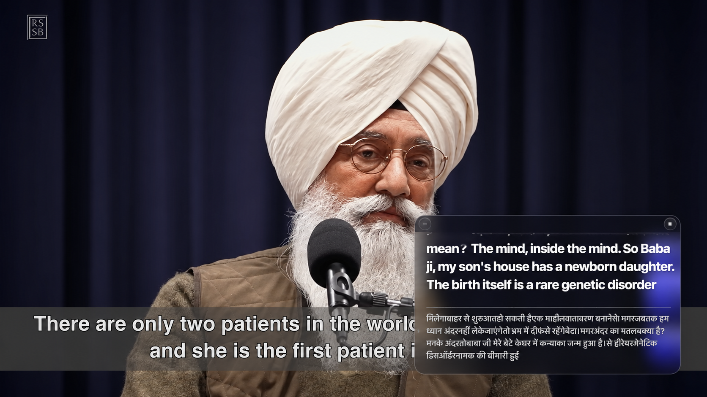
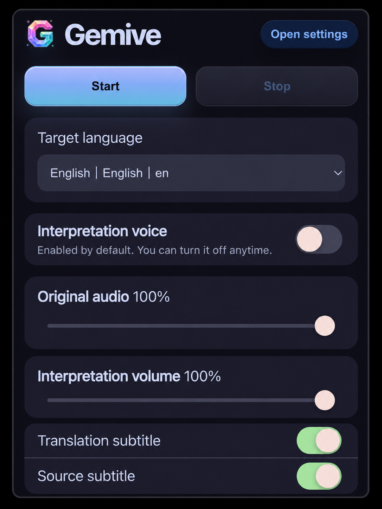
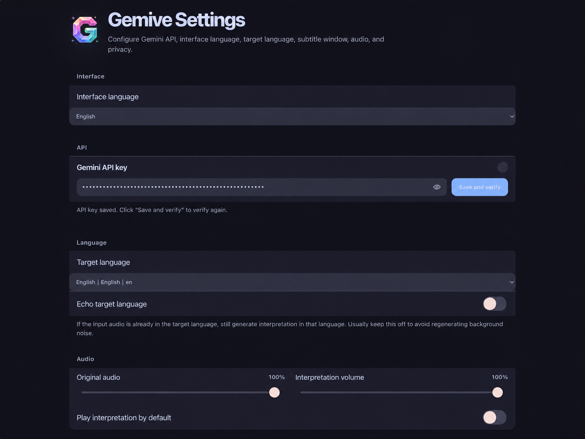

#  Gemive

[English](README.md) | [简体中文](README.zh-Hans.md) | [繁體中文](README.zh-Hant.md)

Gemive 是一款 Chrome Manifest V3 擴充功能，為目前 Chrome 分頁提供即時翻譯字幕與同步口譯音訊。

它擷取分頁音訊，將 PCM 音訊串流傳輸至 Gemini Live Translate，渲染浮動字幕視窗，播放翻譯後的同步口譯音訊，並可將儲存的逐字稿匯出為 Markdown。

## 預覽

<p align="center">
  
</p>
<p align="center">
  
</p>
<p align="center">
  
</p>

## 功能

- 目前 Chrome 分頁的即時字幕
- 來源字幕與翻譯字幕顯示
- Gemini Live Translate WebSocket 整合
- 翻譯後的同步口譯音訊播放
- `chrome.tabCapture` 後的原始分頁音訊直通
- 支援拖曳、縮放、樣式控制與全螢幕重新定位的浮動覆蓋層
- 可選的僅啟動器摺疊模式，附可拖曳 Logo
- 單一活躍翻譯工作階段，支援分頁切換
- 逐字稿儲存至 Chrome 本地儲存空間
- 透過 Chrome Downloads API 匯出 Markdown 逐字稿
- Catppuccin Mocha 風格的深色 UI
- 繁體中文、簡體中文與英文介面在地化
- 支援逗號分隔的多個 Gemini API 金鑰，工作階段啟動時隨機選擇

## 運作原理

```txt
目前 Chrome 分頁音訊
→ chrome.tabCapture
→ 背景文件
→ AudioContext 直通
→ AudioWorklet 降混 + 重新取樣
→ PCM16 16 kHz 音訊資料區塊
→ Gemini Live Translate
→ 字幕覆蓋層 + 同步口譯音訊播放
→ 可選的 Markdown 逐字稿匯出
```

擴充功能一次只保持一個活躍翻譯工作階段。如果另一個分頁正在翻譯，彈出選單會提供切換操作，而非啟動多個並行工作階段。

## 系統需求

- 支援 Manifest V3 的 Google Chrome 或 Chromium 瀏覽器
- 具有已設定即時翻譯模型存取權限的 Gemini API 金鑰
- 帶有可播放音訊的普通網頁分頁

預設模型在 `core/settings.js` 中設定：

```js
model: 'gemini-3.5-live-translate-preview'
```

模型可用性取決於您的 Gemini API 存取權限，並可能隨時間變更。

## 本地安裝

1. 下載或複製此倉庫。
2. 開啟 `chrome://extensions`。
3. 啟用**開發人員模式**。
4. 點擊**載入未封裝項目**。
5. 選擇專案資料夾。
6. 開啟 **Gemive 設定**。
7. 新增您的 Gemini API 金鑰。
8. 開啟一個帶有音訊的分頁。
9. 點擊 Gemive 工具列圖示並開始翻譯。

## API 金鑰

要使用 Gemini API，請前往 Google AI Studio 並使用您的 Google 帳戶登入。開啟 API Keys 頁面。新帳戶通常會自動獲得免費專案和 API 金鑰。如果沒有看到，只需點擊 Create API key 建立一個。

Gemive 支援在設定頁面新增一個或多個 Gemini API 金鑰。

使用逗號分隔的金鑰：

```txt
key_1, key_2, key_3
```

工作階段啟動時，Gemive 會隨機選擇一個可用金鑰。這在跨多個開發金鑰測試時很有用，但不能繞過提供者的配額、政策或計費限制。

## 逐字稿匯出

預設啟用逐字稿儲存。

儲存的逐字稿首先儲存在 Chrome 本地儲存空間中。匯出時，Gemive 透過 Chrome Downloads API 建立 Markdown 檔案：

```txt
Downloads/Gemive/Transcripts/gemive-transcripts-<timestamp>.md
```

Chrome 擴充功能無法靜默寫入任意本地檔案系統路徑，因此匯出資料夾是 Downloads 下的相對路徑。

## 隱私與資料流

Gemive 在本地處理音訊，直到將編碼的音訊資料區塊傳送至已設定的 Gemini Live Translate 端點。API 金鑰和逐字稿儲存在 `chrome.storage.local` 中。

除錯記錄也儲存在本地，並在持久化之前隱藏類似 API 金鑰的值。

在發佈或散佈您自己的建置版本之前，請檢查：

- `manifest.json` 權限
- Gemini API 使用和計費影響
- 您的目標使用者是否需要啟用逐字稿儲存
- 您的倉庫授權和隱私聲明

## 權限

| 權限 | 用途 |
| --- | --- |
| `tabCapture` | 擷取目前分頁音訊 |
| `offscreen` | 在可見頁面之外執行 AudioContext、WebSocket 和播放 |
| `storage` | 儲存設定、逐字稿和除錯記錄 |
| `activeTab` | 解析彈出選單操作的活躍分頁 |
| `scripting` | 注入或重新開啟字幕覆蓋層 |
| `downloads` | 將逐字稿匯出為 Markdown 檔案 |
| `tabs` | 追蹤活躍工作階段分頁和 URL 變更 |
| `<all_urls>` | 允許在普通網頁上注入覆蓋層 |

## 開發

本專案有意不設建置步驟。

```bash
npm install
npm run check
npm run zip
```

等效的直接指令：

```bash
node scripts/check-syntax.mjs
node scripts/package-zip.mjs
```

## 專案結構

```txt
assets/                 擴充功能圖示和預覽截圖
background/             MV3 背景服務工作者和工作階段編排
content/                浮動字幕覆蓋層
core/                   共用設定、國際化、訊息類型、逐字稿緩衝區
options/                完整設定頁面
popup/                  工具列彈出選單控制項
storage/                設定和逐字稿持久化
offscreen/              音訊擷取、編碼、Gemini 用戶端、播放
scripts/                語法檢查和封裝輔助工具
docs/                   架構說明和手動測試計畫
```

## 已知限制

- 一次只支援一個活躍翻譯工作階段。
- 受限頁面（如 `chrome://` 頁面）無法執行內容覆蓋層。
- 分頁音訊擷取會變更瀏覽器音訊路徑；Gemive 透過 `AudioContext` 將擷取的音訊路由回揚聲器。
- 長時間執行的翻譯取決於分頁音訊可用性、Gemini 連線穩定性和提供者端限制。
- 逐字稿匯出受 Chrome Downloads API 行為限制。
